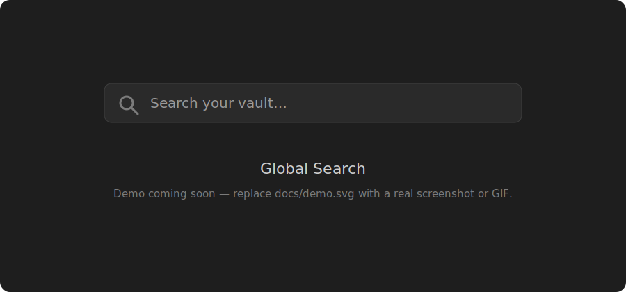

# Global Search

A command-bar style global search for Obsidian. Press a shortcut, search across note titles, headings, and content, then jump straight to the match — which lights up so you can spot it instantly.

<!-- Replace docs/demo.svg with a real screenshot or GIF of the plugin in action. -->


## Features

- **Fuzzy search** across note titles, headings, and content from one prompt.
- **Configurable scope** — match filenames only, content only, or both.
- **Jump to the match** and scroll it into view, with a one-time highlight animation to draw your eye.
- **Configurable highlight** — keep it, clear it after 5 seconds, or turn it off.
- **Configurable result rows** — show or hide the filename, folder path, and matched snippet.
- **Open in the current tab or a new tab.**
- **Recent files** when the prompt is empty.

## Installation

### Manual (local) install

1. Download `main.js`, `manifest.json`, and `styles.css` from the latest [release](../../releases) (or build them — see below).
2. Create the folder `<your-vault>/.obsidian/plugins/global-search/` and copy the three files into it.
3. In Obsidian, open **Settings → Community plugins**, reload plugins (or restart Obsidian), and enable **Global Search**.

### Build from source

```bash
npm ci
npm run build
```

This writes `main.js`. Copy `main.js`, `manifest.json`, and `styles.css` into `<your-vault>/.obsidian/plugins/global-search/` as above.

### BRAT

You can also install via the [BRAT](https://github.com/TfTHacker/obsidian42-brat) community plugin by adding this repository as a beta plugin.

## Usage

1. Press **Cmd/Ctrl + Shift + K** (rebindable in **Settings → Hotkeys**) to open the search prompt.
2. Type to search. Use **↑/↓** to move through results and **↵** to open the selected one.
3. The note opens scrolled to the match, which briefly highlights.

## Settings

| Setting | Values | Default | Effect |
| --- | --- | --- | --- |
| Search scope | Filenames only / Content only / Filenames and content | Filenames and content | Which parts of a note are matched. |
| Show filename | on / off | on | Show the note name in a result row. |
| Show file path | on / off | on | Show the folder path in a result row. |
| Show matched content | on / off | on | Show the matched heading/line snippet. |
| Highlight on open | Keep highlight / Remove after 5 seconds / Don't highlight | Keep highlight | How the match is highlighted after you jump to it. |
| Open results in a new tab | on / off | off | Open in a new tab instead of the current one. |

## Development

```bash
npm ci          # install dependencies
npm run dev     # esbuild watch mode
npm run build   # typecheck + production build
npm run test    # run the unit tests
```

To cut a release, bump `version` in `manifest.json` (and update `versions.json` if `minAppVersion` changed), then push a tag like `v1.0.0` — the release workflow builds and publishes the assets.

## License

[MIT](LICENSE) © Maksim Radaev
